# Ranking 数据集与模型结果对比分析

本文汇总 `ranking_fuxi`、`ranking_taac2026` 与 `ranking_taobao_adx1` 的代表性实验结果，从原始数据规模、特征数量、数据切分、训练评估设置和不同模型结果趋势几个角度进行对比，便于后续撰写分析报告。

## 1. 实验对象与数据来源

| 项目 | 数据来源 | 当前实验数据目录 | 任务形式 |
| --- | --- | --- | --- |
| `ranking_fuxi` | FuxiCTR `AmazonElectronics_x1` benchmark | `projects/ranking_fuxi/outputs/raw/amazonelectronics_x1/` | 二分类 CTR/ranking |
| `ranking_taac2026` | TAAC2026 sample 数据 | `projects/ranking_taac2026/outputs/raw/data_sample_1000/` | 二分类 ranking，`label_type == 2` 映射为正样本 |
| `ranking_taobao_adx1` | TaobaoAd_x1 processed sample 数据 | `data_preprocess/taobao_adx1/processed_sample/` | 二分类 CTR/ranking，sample 阶段使用 2-day 抽样数据 |

三个项目都被转换为 RecKit 通用 raw CSV 格式，主要包含 `seq.csv`、`user_info.csv`、`item_fea.csv` 和 `data_format.csv`。

## 2. 三个 Ranking 模型的统一端到端流程图

这一部分可作为画图底稿使用。整体思路不是把 `DCNv2`、`RankMixer`、`OneTrans` 分开孤立描述，而是先画一条共享主链，再在“特征交互/序列表达层”处分叉成三个模型分支，最后再汇合到统一的训练、验证和推理输出。

### 2.1 推荐画法：先共享主线，再模型分叉

```text
[原始数据源]
Fuxi / TAAC2026 / TaobaoAd_x1 / Taobao Ad
		  |
		  v
[RecKit 通用 Raw 层]
seq.csv + user_info.csv + item_fea.csv + data_format.csv
		  |
		  v
[ranking process.py 数据构建层]
1. 读取 schema 与字段类型
2. 按 uid + timestamp 排序交互日志
3. 构造 target item / history items / history timestamps / context
4. 按规则切分 train / valid / test 或 k-fold
5. 建立 user_id / item_id 索引映射并编码样本
6. 输出张量缓存、meta、特征定义
		  |
		  v
[统一输入样本层]
user features + target item features + history features + context features + label
		  |
		  v
[模型编码层: 三模型分叉]
	|-------------------|--------------------|
	v                   v                    v
 [DCNv2]           [RankMixer]          [OneTrans]
 显式交叉            分块 token 混合         因果序列 Transformer
 + DNN              + 历史摘要路由          + 金字塔压缩
	|                   |                    |
	|-------------------|--------------------|
		  v
[统一预测头]
logit -> sigmoid -> click / action probability
		  |
		  v
[统一训练评估层]
Binary Cross Entropy / AUC / Logloss / GAUC / early stop / best checkpoint
		  |
		  v
[统一推理输出层]
单样本 CTR 打分 / 批量评估 / benchmark summary
```

这张图的重点不是把三个模型画成三条完全独立的 pipeline，而是强调它们共享同一套数据接口、样本构造逻辑、训练目标和评估口径，真正的差异集中在中间的表征建模层。

### 2.2 共享主线的模块含义

#### A. 原始数据与通用接口层

所有 ranking 项目都会先把原始数据整理成统一格式：

- `seq.csv`：行为序列主表，至少包含 `uid`、`iid`、`timestamp`、`label/action`
- `user_info.csv`：用户静态特征表
- `item_fea.csv`：物品静态特征表
- `data_format.csv`：字段角色、类型、来源的 schema 描述

这一层的意义是把不同来源的数据集先压成统一接口，使后续三个模型可以复用同一套样本构建逻辑，而不是每个模型单独写一套数据处理流程。

#### B. ranking process 数据构建层

三套模型各自有 `process.py`，但主流程高度一致，核心都围绕“从行为日志生成监督样本”展开。以 [reckit/ranking/dcn_v2/process.py](reckit/ranking/dcn_v2/process.py) 为代表，其样本构造逻辑包括：

1. 将 `seq.csv` 按 `uid + timestamp` 排序。
2. 对每个用户滚动维护历史序列 `history`。
3. 当前时刻的 item 作为 `target_iid`。
4. 历史正行为作为 `hist_iid`，并保留 `hist_timestamp`。
5. 当前曝光上下文作为 `context`。
6. 当历史长度达到阈值后，生成一条 ranking sample。
7. 再按时间比例切分或 K-fold 切分为 train/valid/test。
8. 通过索引映射把原始 `uid/iid` 转成连续 id，便于 embedding 查表与缓存。

如果你要把这一层画得更专业，建议突出两个关键词：

- `sample builder`：把日志流转成监督学习样本
- `index mapping`：把原始离散键转成连续整数表示，支撑大规模训练与高效张量化

#### C. 统一输入样本层

进入模型前，三个模型实际消费的是同一种语义样本：

- 用户侧特征
- 目标物品特征
- 历史物品序列及时间序列
- 当前上下文特征
- 二分类标签

因此图里可以把三模型输入画成同一个公共方框，然后再从这里向下分叉。

### 2.3 三个模型如何在中间层分叉

#### 1. DCNv2 分支：显式特征交叉主导

DCNv2 的结构核心在 [reckit/ranking/dcn_v2/model.py](reckit/ranking/dcn_v2/model.py)。它更像“结构化特征交叉网络”，而不是强序列模型。

建议图中描述为：

```text
特征 embedding / pooling
	 -> 拼接为扁平特征向量
	 -> CrossNetV2 或 CrossNetMix 显式交叉
	 -> 并联或串联 MLP
	 -> Linear 输出 logit
```

它的模块特点是：

- 先把 sparse、dense、sequence pooling 结果统一成一个扁平向量
- 用 CrossNet 显式建模高阶特征交叉
- 用 DNN 补充隐式非线性交互
- 最终走线性头输出 CTR logit

所以在整体流程图里，DCNv2 更适合被标注为：

- `结构化特征交叉分支`
- `弱序列、强交叉`

#### 2. RankMixer 分支：分块 token 化 + 历史摘要混合

RankMixer 的关键不只是“用了 token”，而是把 heterogeneous feature blocks 组织成有顺序的 token block，再做参数化/稀疏化 mixing。核心模块在 [reckit/ranking/rankmixer/model.py](reckit/ranking/rankmixer/model.py)。

建议图中描述为：

```text
多源特征 -> ordered block tokenizer
			-> user / target / history / context token blocks
			-> history summary encoder
			-> token mixer / per-token FFN / sparse MoE routing
			-> block encoder
			-> prediction head
```

它和 DCNv2 的差异主要在于：

- 不再把所有输入直接压成一个扁平向量
- 会保留“用户块、目标块、历史块、上下文块”的结构边界
- 对历史序列先做 `mean/max/last/target_attention` 等摘要
- 再通过 token mixing 与 MoE 路由建模块间交互

所以在图里，RankMixer 更适合被标成：

- `块级交互与历史摘要分支`
- `中等强度序列建模 + 强结构化 token 交互`

#### 3. OneTrans 分支：因果序列 Transformer + 金字塔压缩

OneTrans 的主干在 [reckit/ranking/onetrans/model.py](reckit/ranking/onetrans/model.py)。它最适合被理解为“面向 ranking 的序列 Transformer 编码器”。

建议图中描述为：

```text
多源特征 embedding
	 -> 序列 token + 非序列 token 共同编码
	 -> mixed causal attention
	 -> sequence FFN + non-sequence FFN
	 -> pyramid schedule 逐层压缩序列长度
	 -> final representation
	 -> prediction head
```

它的模块特点是：

- 强调历史行为序列的时序依赖建模
- 使用 causal attention，保证当前位置只看过去信息
- 同时处理 sequence token 与 non-sequence token
- 通过 pyramid schedule 逐层压缩序列长度，降低长序列计算成本

所以在整体图里，OneTrans 更适合标成：

- `强序列建模分支`
- `因果注意力 + 金字塔压缩`

### 2.4 三模型在输出层重新汇合

虽然三者中间结构不同，但输出层可以统一画成一条：

```text
representation
	-> logit
	-> sigmoid(probability)
	-> BCE loss / ranking metrics
```

这一步建议强调两个事实：

- 三个模型最终都落到二分类 ranking/CTR 打分
- 它们的实验差异主要来自中间表示学习能力，而不是 loss 形式不同

### 2.5 训练阶段与推理阶段的统一串联方式

如果你要把训练和推理拆成上下两层，可以按下面这个版本画：

```text
训练阶段:
Raw CSV -> process -> sample tensors -> model branch -> logit -> BCE -> AUC/Logloss -> best checkpoint

推理阶段:
Request / test sample -> same feature transform -> trained model branch -> probability score -> ranking result
```

训练阶段的典型特点：

- 有标签监督
- 有数据切分与 early stopping
- 输出 checkpoint 和 benchmark summary

推理阶段的典型特点：

- 不再更新参数
- 复用同一套特征变换与 id 映射
- 输出单条样本分数或整批样本排序结果

### 2.6 适合直接落图的软件分层结构

如果你用亿图、Visio 或 PPT 画图，可以按 6 层结构排版：

1. `数据源层`
	Fuxi / TAAC2026 / TaobaoAd_x1 / Taobao Ad

2. `统一数据接口层`
	`seq.csv` + `user_info.csv` + `item_fea.csv` + `data_format.csv`

3. `样本构建层`
	排序、历史截断、context 提取、切分、index mapping、张量缓存

4. `统一特征输入层`
	user / target item / history / timestamp / context / label

5. `模型分叉层`
	DCNv2 / RankMixer / OneTrans

6. `训练与输出层`
	BCE、AUC、Logloss、checkpoint、inference score、summary

### 2.7 可直接照着画框和箭头的中文框图草稿

如果你现在就要在亿图、Visio 或 PPT 里直接拉框，这一版可以直接照抄节点名。推荐版式是“主干纵向排列 + 中部三分支并排展开 + 底部重新汇合”。

```text
【数据源】
Fuxi / TAAC2026 / TaobaoAd_x1 / Taobao Ad
	|
	v
【统一原始数据层】
seq.csv + user_info.csv + item_fea.csv + data_format.csv
	|
	v
【样本构建层】
行为排序 -> 历史截断 -> target 抽取 -> context 提取 -> train/valid/test 切分
	|
	v
【索引与张量化层】
uid/iid index mapping -> feature encoding -> tensor cache / meta
	|
	v
【统一模型输入层】
用户特征 + 目标物品特征 + 历史序列特征 + 时间特征 + 上下文特征
	|
	v
【表征学习层】
	|------------------------|------------------------|
	|                        |                        |
	v                        v                        v
【DCNv2 分支】           【RankMixer 分支】        【OneTrans 分支】
Embedding/Pooling        Ordered Block Tokenizer   Sequence + Non-sequence Tokens
-> CrossNetMix           -> History Summary        -> Mixed Causal Attention
-> Parallel/Stacked MLP  -> Token Mixer / MoE      -> FFN
-> CTR Logit             -> Block Encoder          -> Pyramid Compression
						  -> CTR Logit             -> CTR Logit
	|                        |                        |
	|------------------------|------------------------|
	v
【统一预测层】
logit -> sigmoid -> click / action probability
	|
	v
【训练评估层】
BCE Loss + AUC / Logloss / GAUC + Early Stopping + Best Checkpoint
	|
	v
【推理输出层】
单样本打分 / 批量排序 / benchmark summary
```

如果你希望图面更像论文图而不是工程流程图，可以把每个框再压缩成下面这组短标题：

- `多源数据输入`
- `统一 Raw 接口`
- `样本构建与切分`
- `索引映射与张量化`
- `统一特征输入`
- `DCNv2: 显式交叉`
- `RankMixer: 块级混合`
- `OneTrans: 因果序列建模`
- `统一 CTR 预测`
- `训练评估输出`

如果你希望图里进一步强调三模型的职责差异，可以在三个模型框下面各补一行副标题：

- `DCNv2`：`适合结构化特征交叉建模`
- `RankMixer`：`适合块级特征交互与历史摘要融合`
- `OneTrans`：`适合长序列时序依赖建模`

### 2.8 一句话总结三者的关系

如果要用一句最适合放在图下方的总述，可以写成：

`RecKit ranking 三模型共享同一套数据接口、样本构建和训练评估框架，差异主要集中在中间表征层：DCNv2 强调显式特征交叉，RankMixer 强调块级 token 混合与历史摘要，OneTrans 强调因果序列注意力与金字塔压缩。`

## 3. 初始数据规模对比

| 数据集 | 交互样本数 `seq.csv` | 用户数 `user_info.csv` | 物品数 `item_fea.csv` | 正样本数 | 负样本数 | 正样本比例 |
| --- | ---: | ---: | ---: | ---: | ---: | ---: |
| Fuxi AmazonElectronics_x1 | 3,185,973 | 192,403 | 63,001 | 1,689,188 | 1,496,785 | 53.02% |
| TAAC2026 sample_1000 | 1,000 | 1,000 | 837 | 124 | 876 | 12.40% |
| TaobaoAd_x1 processed_sample | 809,374 | - | - | - | - | - |

数据规模差异非常明显。Fuxi 是百万级交互数据，且正负样本相对均衡；TAAC2026 当前使用的是 1000 条 sample，小样本且类别明显不均衡，正样本只占 12.4%；TaobaoAd_x1 processed sample 则处于两者之间，sample 总量为 809,374，明显大于 TAAC2026 小样本，但仍远小于 Fuxi 全量规模。对 TaobaoAd_x1 而言，这种中等规模 sample 更适合做方向性调参，但仍可能因为构造方式和切分语义带来偏差。

## 4. 原始字段与实际使用特征

### 4.1 Raw CSV 字段数量

| 数据集 | `seq.csv` 列数 | `user_info.csv` 列数 | `item_fea.csv` 列数 | `data_format.csv` 字段记录数 |
| --- | ---: | ---: | ---: | ---: |
| Fuxi AmazonElectronics_x1 | 4 | 1 | 2 | 7 |
| TAAC2026 sample_1000 | 51 | 57 | 15 | 123 |
| TaobaoAd_x1 processed_sample | 与 TaobaoAd_x1 full raw 格式一致 | 与 TaobaoAd_x1 full raw 格式一致 | 与 TaobaoAd_x1 full raw 格式一致 | 与 TaobaoAd_x1 full raw 格式一致 |

Fuxi 的 raw 数据非常简洁，`seq.csv` 主要是 `uid`、`iid`、`timestamp`、`action`，物品侧只有 `iid` 和 `cate_id`。TAAC2026 的 raw 数据包含更多用户特征、物品特征和多域序列特征，信息维度更丰富，但样本量更小、噪声和过拟合风险也更高。TaobaoAd_x1 的 sample 阶段并没有更换字段体系，而是在同一套 TaobaoAd_x1 raw 字段定义下做样本抽取，因此 sample 与 full-data 的主要差异在于样本构成与切分来源，而不是字段空间本身。

### 4.2 模型实际使用特征

| 数据集 | 模型/配置 | user 特征 | item 特征 | seq 特征 | history 设置 |
| --- | --- | ---: | ---: | ---: | --- |
| Fuxi | DCNv2 / RankMixer / OneTrans 默认配置 | 0 | 2: `iid`, `cate_id` | 0 | `min_history_len=1`, `max_history_len=100`, positive-only |
| Fuxi | DCNv2 + uid 对照 | 1: `uid` | 2: `iid`, `cate_id` | 0 | `min_history_len=1`, `max_history_len=100`, positive-only |
| TAAC2026 | DCNv2 | 18 | 12 | 12 | `min_history_len=0`, `max_history_len=1`, positive-only |
| TAAC2026 | RankMixer / OneTrans | 18 | 12 | 8 | `min_history_len=0`, `max_history_len=1`, positive-only |

Fuxi 实验更接近“少量离散 ID/类别特征 + 较大样本量”的场景；TAAC2026 实验则更接近“小样本 + 多组稀疏/序列/用户物品特征”的场景。这个差异是两个数据集上模型排序不同的重要原因。

## 5. 数据切分方式

| 数据集 | 切分方式 | 训练样本 | 验证样本 | 测试样本 | 备注 |
| --- | --- | ---: | ---: | ---: | --- |
| Fuxi | global time ratio: 0.8 / 0.1 / 0.1 | 2,394,856 | 299,357 | 299,357 | 固定时间切分，test 是独立测试集 |
| TAAC2026 | stratified 10-fold, seed=2026 | fold_00 为 899 | fold_00 为 101 | fold_00 为 101 | 默认 `valid_policy=test`，valid 与 test 使用同一 fold |
| TaobaoAd_x1 processed_sample | global time ratio: 0.8 / 0.1 / 0.1 | 647,499 | 80,937 | 80,938 | `sample_taobaoad_x1_summary.json` 显示三个 split 均 100% 来自原始 `test` source |

Fuxi 的结果更适合作为固定测试集上的最终效果对比。TAAC2026 的 k-fold 结果适合做小样本下的模型和参数比较，但由于当前配置使用 `valid_policy=test`，每一折的最佳 checkpoint 是在同一折上选择并汇报的，因此结果偏乐观，不应视为严格无偏的泛化估计。TaobaoAd_x1 的 processed sample 还有一个额外限制：`sample_taobaoad_x1_summary.json` 显示 train/valid/test 三个 split 全部来自原始 `test` source，说明 sample 调参阶段主要回答的是同源 sample 内的相对模型比较问题，而不是跨原始 train/test source 的泛化问题。

## 6. 训练与评估设置概览

| 数据集 | 模型 | batch size | learning rate | weight decay | early stop | 关键结构/正则 |
| --- | --- | ---: | ---: | ---: | ---: | --- |
| Fuxi | DCNv2 | 1024 | 0.0005 | 0 | 2 | `embedding_dim=64`, mixture cross net, `n_cross_layers=3`, `num_experts=4`, dropout=0.1 |
| Fuxi | RankMixer | 1024 | 0.001 或 0.0005 | 0.00001 | 4 | `d_model=128/120/144`, 多版本调参，dropout 从 0 到 0.1 |
| Fuxi | OneTrans | 1024 | 0.001 | 0.00001 | 4 | `d_model=64`, `head_dropout=0.05` |
| TAAC2026 | DCNv2 | 128 | 0.0005 | 0.0005 | 10 | `embedding_dim=12`, mixture cross net, `n_cross_layers=3`, `num_experts=4`, dropout=0.25 |
| TAAC2026 | RankMixer | 128 | 0.0005 | 0.0005 | 10 | `d_model=64`, `input/token/ffn_dropout=0.15`, `head_dropout=0.30` |
| TAAC2026 | OneTrans | 128 | 0.0005 | 0.0005 | 10 | `d_model=64`, `head_dropout=0.35` |

训练设置也体现了两个数据集的差异：Fuxi 数据量大，使用较大 batch size；TAAC2026 样本少，batch size 降到 128，并提高 weight decay 和 dropout 来抑制过拟合。

## 7. 模型结果对比

### 7.1 Fuxi 固定 test split 结果

| 模型 | Test AUC | Test Logloss | Test GAUC | 结果特点 |
| --- | ---: | ---: | ---: | --- |
| DCNv2 | **0.891124** | **0.421056** | **0.889865** | 综合最优，排序与校准均最好 |
| DCNv2 + uid | 0.887740 | 0.425037 | 0.886275 | 加入 uid 后 test 略降，未带来泛化收益 |
| RankMixer v3 | 0.875315 | 0.522452 | - | RankMixer 系列中 AUC 最高，但 logloss 明显变差 |
| RankMixer v3b | 0.874164 | 0.466831 | - | AUC 接近 v3，logloss 好于 v3 |
| RankMixer v3a | 0.872883 | 0.476149 | - | 与 base 接近 |
| RankMixer base | 0.872827 | 0.461857 | - | 排序能力中等，校准好于 v3/v3a/v3b 中部分版本 |
| RankMixer v2 | 0.864087 | 0.468258 | - | 加 dropout 后 AUC 下降 |
| OneTrans | 0.854598 | 0.503030 | - | 当前配置下最弱 |

Fuxi 上 DCNv2 明显领先。由于该数据集实际使用特征较少，主要依赖 `iid` 与 `cate_id` 等离散特征交叉，DCNv2 的显式交叉网络更容易发挥优势。RankMixer 多个版本验证集表现较高，但 test 上与 DCNv2 仍有明显差距。OneTrans 在该设置下没有体现出优势，可能与可用序列/上下文特征较少有关。

### 7.2 TAAC2026 10-fold 汇总结果

| 模型 | Test AUC mean | AUC std | Test Logloss mean | Logloss std | 结果特点 |
| --- | ---: | ---: | ---: | ---: | --- |
| OneTrans | **0.708994** | **0.036318** | 0.452121 | 0.188649 | AUC 最优且 fold 间最稳定 |
| DCNv2 | 0.684480 | 0.074833 | 0.507955 | 0.090822 | AUC 波动最大，偏 AUC-oriented |
| RankMixer | 0.683599 | 0.060104 | **0.419460** | **0.060058** | Logloss 最优，概率校准更稳 |

按 10 个 fold 的单折胜场统计，OneTrans 获得 6 个 fold 的 AUC 第一，DCNv2 获得 3 个 fold 的 AUC 第一，RankMixer 获得 1 个 fold 的 AUC 第一。按 logloss 统计，RankMixer 有 5 个 fold 最优，OneTrans 有 3 个 fold 最优，DCNv2 有 2 个 fold 最优。

TAAC2026 上 OneTrans 的优势更明显，说明在多用户、多物品、多域序列特征的小样本设置中，Transformer 类结构对排序指标更友好。RankMixer 虽然 AUC 不最高，但 logloss 最低且 std 也最低，说明输出概率更稳定。DCNv2 在部分 fold 表现很好，但整体波动较大，可能更依赖具体 fold 的样本分布。

### 7.3 TaobaoAd_x1 sample 调参最佳结果

以下结果仅统计 `projects/ranking_taobao_adx1/log/` 下 `processed_sample_v*` 日志中每个模型的最佳调参记录，各模型只保留 test AUC 最优的一版，用于总结 sample 阶段的调参结论。

| 模型 | 最佳版本 | Best Valid AUC | Valid Logloss | Test AUC | Test Logloss | 结论 |
| --- | --- | ---: | ---: | ---: | ---: | --- |
| DCNv2 | `processed_sample_v3` | 0.544643 | 0.171638 | **0.525308** | 0.157070 | 三个模型中 sample test AUC 次优，优于早期 baseline/v1/v2，说明回到更稳的 baseline 结构并做小幅收敛调整更有效。 |
| OneTrans | `processed_sample_v1` | **0.575190** | 0.151309 | **0.546427** | 0.133150 | sample 阶段综合最优，valid/test AUC 都明显领先，说明在该 sample 切分下序列与上下文建模收益最大。 |
| RankMixer | `processed_sample_v1` | 0.529285 | 0.152205 | **0.523890** | 0.133369 | 后续 v2/v3/v4 都未超过 v1，说明 RankMixer 对当前 sample 配置较敏感，结构改动不如保守配置稳定。 |

从 sample 调参结果看，TaobaoAd_x1 的模型排序为 `OneTrans > DCNv2 > RankMixer`。但这些结论仅适用于 sample 阶段的相对比较：sample 数据与后续 full-data pseudo-time 切分回答的是不同问题，因此不应直接把 sample 最优排序外推为 full-data 的最终泛化结论。

### 7.4 TaobaoAd_x1 blocked time K-fold 汇总结果

`projects/ranking_taobao_adx1/run_kfold.py` 采用 blocked time K-fold 评估：先按时间顺序将样本切成 `k=5` 个连续时间块，再轮流选择 1 个 fold 作为 test fold，并按默认 `valid_policy=adjacent` 选择相邻时间块作为 valid fold，其余 fold 用于训练。相比单次 sample 切分，这组结果更适合观察模型在时间块滚动评估下的平均表现与稳定性。

| 模型 | Test AUC mean | AUC std | Test Logloss mean | Logloss std | Valid AUC mean | 结果特点 |
| --- | ---: | ---: | ---: | ---: | ---: | --- |
| OneTrans | **0.550900** | 0.014271 | 0.205527 | 0.058579 | **0.554740** | K-fold 下 AUC 仍然最高，说明 OneTrans 在时间块滚动评估下的平均排序能力最好，但 logloss 波动也最大。 |
| DCNv2 | 0.534515 | **0.005036** | 0.208748 | 0.043291 | 0.554144 | Test AUC 次优，但 AUC 标准差最小，说明 DCNv2 在 blocked time K-fold 下更稳。 |
| RankMixer | 0.520797 | 0.011431 | **0.199333** | 0.045935 | 0.521800 | 平均 AUC 最低，但 test logloss 最优，延续了 RankMixer 概率校准较好、排序能力偏弱的特点。 |

从 K-fold 汇总结果看，TaobaoAd_x1 在 blocked time 评估下的模型排序仍然是 `OneTrans > DCNv2 > RankMixer`。不过和 sample 单次切分相比，K-fold 更强调跨时间块平均表现，因此更适合作为模型相对排序的补充证据；如果后续 full-data pseudo-time 切分结果与这里不一致，应优先从切分语义和时间构造方式差异解释，而不是直接认定模型结论反转。

### 7.5 AmazonElectronics_x1 与 TaobaoAd_x1 三模型最佳指标汇总

为便于横向比较，这里只保留两个数据集上三个主模型的最佳 `Test AUC` 与 `Test Logloss`。其中 AmazonElectronics_x1 取 Fuxi 固定 test split 下各模型最佳版本；TaobaoAd_x1 取 sample 调参阶段各模型 `Test AUC` 最优版本。由于两个数据集的切分语义不同，下面的绝对值更适合做同一数据集内的模型排序对比，而不宜直接解读为跨数据集泛化强弱。

| 数据集 | 模型 | 最佳版本 | Best Test AUC | Best Test Logloss |
| --- | --- | --- | ---: | ---: |
| AmazonElectronics_x1 | DCNv2 | default | **0.891124** | **0.421056** |
| AmazonElectronics_x1 | RankMixer | v3 | 0.875315 | 0.522452 |
| AmazonElectronics_x1 | OneTrans | default | 0.854598 | 0.503030 |
| TaobaoAd_x1 | DCNv2 | `processed_sample_v3` | 0.525308 | 0.157070 |
| TaobaoAd_x1 | RankMixer | `processed_sample_v1` | 0.523890 | 0.133369 |
| TaobaoAd_x1 | OneTrans | `processed_sample_v1` | **0.546427** | **0.133150** |

从 AUC 看，AmazonElectronics_x1 上的排序为 `DCNv2 > RankMixer > OneTrans`，而 TaobaoAd_x1 上的排序为 `OneTrans > DCNv2 > RankMixer`。从 Logloss 看，AmazonElectronics_x1 仍是 DCNv2 最优；TaobaoAd_x1 上则是 OneTrans 与 RankMixer 明显更低，且 OneTrans 以微弱优势最好。

#### 7.5.1 Best Test AUC 柱状图

```mermaid
xychart-beta
	title "AmazonElectronics_x1 vs TaobaoAd_x1 Best Test AUC"
	x-axis [DCNv2, RankMixer, OneTrans]
	y-axis "Test AUC" 0.50 --> 0.92
	bar "AmazonElectronics_x1" [0.891124, 0.875315, 0.854598]
	bar "TaobaoAd_x1" [0.525308, 0.523890, 0.546427]
```



#### 7.5.2 Best Test Logloss 柱状图

```mermaid
xychart-beta
	title "AmazonElectronics_x1 vs TaobaoAd_x1 Best Test Logloss"
	x-axis [DCNv2, RankMixer, OneTrans]
	y-axis "Test Logloss" 0.10 --> 0.55
	bar "AmazonElectronics_x1" [0.421056, 0.522452, 0.503030]
	bar "TaobaoAd_x1" [0.157070, 0.133369, 0.133150]
```



## 8. 跨数据集趋势总结

| 观察角度 | Fuxi | TAAC2026 | 分析结论 |
| --- | --- | --- | --- |
| 数据规模 | 百万级交互 | 1000 条 sample | Fuxi 结果更稳定，TAAC 更易受 fold 切分影响 |
| 类别分布 | 正负较均衡 | 正样本仅 12.4% | TAAC 的 AUC/logloss 对少数正样本更敏感 |
| 特征结构 | 特征少，主要是 item ID/类别 | 特征多，包含 user/item/seq 多域特征 | DCNv2 更适合 Fuxi 的离散交叉；OneTrans 更适合 TAAC 的多域序列上下文 |
| 切分方式 | 固定时间切分，独立 test | 10-fold，valid/test 同 fold | 两者绝对指标不能直接比较，只能比较各自项目内模型排序 |
| AUC 最优模型 | DCNv2 | OneTrans | 最优模型依赖数据形态 |
| Logloss 最优模型 | DCNv2 | RankMixer | 排序最优与校准最优不一定一致 |
| 稳定性 | DCNv2 test 最稳 | OneTrans AUC std 最低，RankMixer logloss std 最低 | TAAC 中需要分别看排序稳定性和概率校准稳定性 |

## 9. 可用于报告的结论表述

1. 在 FuxiCTR AmazonElectronics_x1 上，DCNv2 取得最优 test AUC、GAUC 和 logloss，说明在大规模、特征较少且以离散 ID/类别为主的 CTR 场景中，显式特征交叉结构具有明显优势。

2. 在 TAAC2026 sample_1000 上，OneTrans 取得最高 10-fold mean AUC，且 AUC 标准差最低，说明其在多域序列与用户物品上下文特征较多的小样本场景下排序能力更稳定。

3. RankMixer 在 TAAC2026 上的 logloss 最低，表明其概率校准能力较好；但 AUC 低于 OneTrans，说明校准能力和排序能力存在权衡。

4. 在 TaobaoAd_x1 sample 调参阶段，OneTrans `processed_sample_v1` 取得最高 test AUC 0.546427，DCNv2 `processed_sample_v3` 次之，RankMixer 以 `processed_sample_v1` 最稳，说明该数据在 sample 切分下更偏向受益于 OneTrans 的序列/上下文表达，而 RankMixer 对结构与超参扰动更敏感。

5. 在 TaobaoAd_x1 blocked time K-fold 结果中，OneTrans 仍保持最高 mean test AUC 0.550900，DCNv2 的 AUC 标准差最低，RankMixer 的 mean test logloss 最低，说明该数据集上仍然存在“排序最优”和“校准最优”分离的现象，且 DCNv2 的稳定性优势比单次 sample 结果更明显。

6. DCNv2 加入 `uid` 后在 Fuxi test 上略低于默认 DCNv2，说明简单增加用户 ID 不一定改善泛化，可能引入用户记忆或噪声，后续可进一步检查冷启动用户比例、用户频次分布和正负样本时间漂移。

7. TAAC2026 当前 k-fold 采用 `valid_policy=test`，因此结果适合做模型与超参数的相对比较，但不宜作为严格泛化能力结论。若用于正式报告，建议补充一个 valid/test 分离的 k-fold 或留出测试集实验。

## 10. 后续分析建议

| 方向 | 建议 |
| --- | --- |
| 更公平的 TAAC 评估 | 将 `valid_policy` 改为独立验证折，避免 best checkpoint 选择和 test 汇报使用同一 fold |
| Fuxi 模型改进 | 给 OneTrans/RankMixer 引入更丰富的历史序列或上下文特征，再比较是否缩小与 DCNv2 的差距 |
| TAAC 数据扩展 | 使用更大 TAAC 样本或全量数据，观察 OneTrans 优势是否保持 |
| 指标补充 | 同时报告 AUC、GAUC、logloss，并区分排序效果与概率校准效果 |
| 稳定性分析 | 对 TAAC 输出每 fold 曲线和胜场统计，避免只看 mean 掩盖 fold 间差异 |
