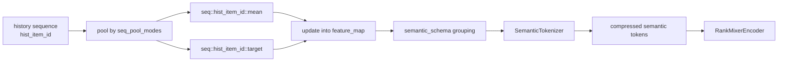
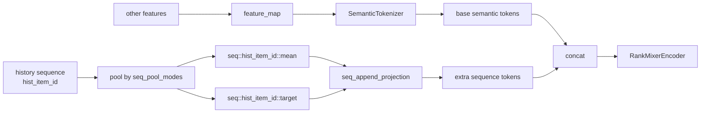

# RankMixer 临时说明

本文档临时整理两部分内容：

1. RankMixer 的数据特征构建与主模型功能
2. `semantic_schema`、`build_rankmixer_semantic_groups` 与 `SemanticTokenizer` 的关系

## 1. RankMixer 的数据特征构建

RankMixer 的数据入口在 [dataset.py](d:/code/keke/torch-rechub/generative_ranking/data/dataset.py)。

它会把原始字段拆成四类：

1. `user_sparse` / `item_sparse`
   - 构造成 `SparseFeature`
   - 后续先做 embedding lookup

2. `user_dense` / `item_dense`
   - 构造成 `DenseFeature`
   - 后续直接输入数值，再投影到统一维度

3. `item_sequence`
   - 也属于 `SequenceFeature`
   - 但在 RankMixer 中它不是“真实历史序列”
   - 它更像上下文多值属性，比如目标物品的多标签、多 genre
   - 进入模型后不会保留逐步 token，而是先池化成一个固定向量

4. `sequence`
   - 这才是 RankMixer 的真实用户历史序列
   - 会单独生成 `rankmixer_seq_features`
   - 要求 `rankmixer_pooling="concat"`
   - 模型内部再按 `seq_pool_modes` 生成 summary，例如 `mean`、`target`

这一点非常关键：

- `features` 里的 `SequenceFeature` 是上下文多值属性
- `sequence_features` 参数里的 `SequenceFeature` 才是真正的用户历史序列

## 2. RankMixer 主模型做什么

主模型在 [rankmixer.py](d:/code/keke/torch-rechub/generative_ranking/models/rankmixer.py)。

可以把前向过程理解成四步。

### 第一步：构造 `feature_map`

入口是 `_build_feature_map`。

- sparse 特征：embedding 后放进 `feature_map`
- dense 特征：直接取值，再投影后放进 `feature_map`
- context sequence 特征：先池化，再投影后放进 `feature_map`
- history sequence 特征：不会直接变成逐步 token，而是先按 `seq_pool_modes` 生成多个 summary

例如：

- `hist_item_id` 经过 `mean` 池化后会得到 `seq::hist_item_id::mean`
- `hist_item_id` 经过 `target` 池化后会得到 `seq::hist_item_id::target`

### 第二步：做 semantic tokenization

`SemanticTokenizer` 的职责不是做复杂交互，而是：

- 把 feature-level 表示压成固定数量 token
- 每个 token 尽量对应一个语义组或一段 feature chunk

所以 RankMixer 的核心思路不是“直接拿原始字段做 attention”，而是：

1. 先把各种异构特征整理成统一语义向量
2. 再压成少量语义 token

### 第三步：做 token interaction

压完 token 后，才进入 `RankMixerEncoder`。

每个 block 主要包括：

1. `ParameterFreeTokenMixer`
   - 负责 token 间混合

2. `PerTokenFFN` 或 `PerTokenSparseMoE`
   - 负责 token 内变换

也就是说，RankMixer 的 encoder 只处理“已经语义化后的 token”，不再直接处理原始字段。

### 第四步：pooling 与 CTR head

encoder 输出后：

- 默认对 token 做 `mean pooling`
- 送入两层 MLP
- 最后通过 sigmoid 输出 CTR 概率

所以一句话概括 RankMixer 主干：

先统一异构特征与历史序列摘要，再压成语义 token，然后只在语义 token 层面做轻量交互与预测。

## 3. `semantic_schema` 是做什么的

`semantic_schema` 定义在数据配置里，例如 [data.json](d:/code/keke/torch-rechub/generative_ranking/config/movielens/data.json)。

MovieLens 示例：

```json
"semantic_schema": [
  {
    "name": "user_profile",
    "features": ["uid", "gender", "age", "occupation", "zip_code"]
  },
  {
    "name": "target_item",
    "features": ["target_item_id", "target_genres"]
  },
  {
    "name": "sequence_global",
    "sequence_features": ["hist_item_id"],
    "pool_modes": ["mean"]
  },
  {
    "name": "sequence_target",
    "sequence_features": ["hist_item_id"],
    "pool_modes": ["target"]
  }
]
```

它表达的不是“具体 tensor 怎么算”，而是“哪些 feature 应该被视为一个语义组”。

例如：

- `user_profile` 表示用户画像组
- `target_item` 表示目标物品组
- `sequence_global` 表示历史序列的全局兴趣摘要
- `sequence_target` 表示历史序列的最近兴趣摘要

所以 `semantic_schema` 决定的是：

- tokenizer 该按什么语义把 feature 组织成 token
- 每个 token 想表达哪一类语义信息

## 4. `build_rankmixer_semantic_groups` 做了什么

代码在 [rankmixer_grouping.py](d:/code/keke/torch-rechub/generative_ranking/models/rankmixer_grouping.py)。

它做两件事。

### 4.1 先规范化 schema

`normalize_rankmixer_group_schema` 会把每个 group 变成统一结构：

- `name`
- `features`
- `sequence_features`
- `pool_modes`

这一步还不会直接产出 tokenizer 真正使用的 feature key。

### 4.2 再把序列组展开成真实 feature 名

`build_rankmixer_semantic_groups` 会把：

- 普通 `features` 原样保留
- `sequence_features + pool_modes` 展开成 `seq::<name>::<mode>`

例如：

```text
sequence_features = ["hist_item_id"]
pool_modes = ["mean", "target"]
```

会展开成：

```text
seq::hist_item_id::mean
seq::hist_item_id::target
```

这是因为模型内部在 `_build_feature_map` 里，真实生成的历史序列 summary key 就是这种格式。

也就是说：

- 配置里写的是“抽象序列名 + 需要的摘要方式”
- 传给 tokenizer 前，必须展开成“模型真实会产出的 feature key”

## 5. `SemanticTokenizer` 如何消费这些语义组

代码在 [tokenization.py](d:/code/keke/torch-rechub/generative_ranking/basic/tokenization.py)。

当 `semantic_groups` 存在时，它的逻辑是：

1. 遍历每个 group
2. 找到该组对应的 feature key
3. 把组内多个 feature 向量拼接起来
4. 用一层线性投影映射成一个 token

所以一个语义组最终通常对应一个 token。

例如：

- `user_profile` 组里的 `uid/gender/age/...` 会先拼接
- 然后投影成一个 `user_profile token`

- `sequence_target` 组里的 `seq::hist_item_id::target`
- 会被投影成一个“最近兴趣”token

如果组数少于 `target_tokens`，tokenizer 会补零 token；如果组数多于 `target_tokens`，会截断到目标数量。

## 6. 一条完整链路

从配置到模型，链路如下：

1. `data.json` 定义原始字段和 `semantic_schema`
2. `build_feature_columns` 把字段构造成 `SparseFeature` / `DenseFeature` / `SequenceFeature`
3. `RankMixer._build_feature_map` 生成普通 feature 向量和序列 summary 向量
4. `build_rankmixer_semantic_groups` 把 schema 展开成真正的语义组 key
5. `SemanticTokenizer` 把每个语义组压成一个 token
6. `RankMixerEncoder` 对 token 做轻量交互
7. CTR head 输出预测

最短理解方式：

- `semantic_schema` 负责定义“token 想表达什么语义”
- `_build_feature_map` 负责真正算出这些语义所需的 feature 向量
- `SemanticTokenizer` 负责把这些向量压成固定 token

## 7. 历史序列 summary 的两条接入路径

对真实历史序列特征，RankMixer 不会直接保留逐步 token 到 encoder。

它会先在 `_build_feature_map` 里，把一条历史序列按 `seq_pool_modes` 变成多个 summary 向量，例如：

- `seq::hist_item_id::mean`
- `seq::hist_item_id::target`

这些 summary 向量随后有两条接入路径。

### 7.1 路径一：进入 tokenizer

当 `include_seq_in_tokenization=True` 时：



这条路径的含义是：

- 历史序列 summary 被当成普通 feature 看待
- 它会和用户特征、目标物品特征一起参与语义分组
- 最终会被压缩进固定 token 预算里

所以它更像：

- sequence summary as semantic feature

### 7.2 路径二：作为额外 token 追加

当 `include_seq_in_tokenization=False` 时：



这条路径的含义是：

- 历史序列 summary 不参加 tokenizer 压缩
- tokenizer 只处理普通特征
- 每个 sequence summary 会先投影到 `d_model`，再作为独立 token 拼到后面

所以它更像：

- sequence summary as explicit token

### 7.3 两条路径的最本质区别

它们的差异不在于“有没有使用历史序列”，而在于：

1. 历史序列摘要是作为普通语义特征被压缩
2. 还是作为独立 token 被显式保留

如果进入 tokenizer：

- 融合更早
- token 数更稳定
- 但 sequence summary 可能被压缩得更隐式

如果作为额外 token：

- 结构更清晰
- sequence summary 身份更明确
- 但 token 数会上升，后续 encoder 负担更高一些

## 8. 两种建模方式哪种更好

没有绝对更好，取决于你想保留的 inductive bias。

### 8.1 通常更稳的默认选择：进入 tokenizer

如果你的目标是：

- 控制 token 预算
- 让序列摘要和其他异构特征尽早融合
- 让不同数据集下 token 数保持更稳定

那么 `include_seq_in_tokenization=True` 往往是更稳妥的默认选项。

原因是：

1. RankMixer 的设计重心本来就是“feature-to-token compression”
2. tokenizer 的语义分组可以显式规定 sequence summary 应该和哪些 feature 一起组织
3. encoder 看到的 token 数更固定，结构更接近 RankMixer 的原始设计哲学

在这种设置下，历史序列摘要更像是：

- 用户长期兴趣的一部分语义描述

而不是必须单独保留的一类 token。

### 8.2 更强调序列身份时：作为额外 token 更合适

如果你的目标是：

- 希望不同 summary 视图彼此独立
- 希望模型明确区分“用户画像 token”和“序列兴趣 token”
- 不希望 tokenizer 在压缩时把序列摘要和别的特征混合得太早

那么 `include_seq_in_tokenization=False` 更合理。

这时的好处是：

1. `mean`、`target` 等 summary 都有清晰的 token 身份
2. 后续 encoder 能直接对这些 sequence tokens 做交互
3. 更容易观察或解释不同 sequence summary 在模型里的作用

代价是：

1. token 数增加
2. `num_heads == token_count` 约束下，结构参数也要跟着适配
3. 当 summary 视图很多时，token 预算容易膨胀

### 8.3 实践判断

如果是当前这个 RankMixer 实现，我会这样建议：

1. 单条历史序列，summary 数不多，而且你更看重整体稳健性：优先 `include_seq_in_tokenization=True`
2. 多个 summary 视图承担明确不同语义，比如“长期兴趣”和“最近兴趣”差异很强：可以尝试 `include_seq_in_tokenization=False`
3. 如果数据集里非序列特征很多、语义组设计很成熟：更适合放进 tokenizer
4. 如果你更想把 sequence summary 当成与普通 feature 平级但独立的信号源：更适合额外 token

### 8.4 从 RankMixer 设计哲学看

如果只从这份实现的主设计出发，我会把：

- `include_seq_in_tokenization=True`

视为更“原生”的 RankMixer 风格。

因为它更符合下面这条主线：

1. 先把异构信号都整理成 feature-level 表示
2. 再统一压成少量语义 token
3. 最后只在语义 token 层做交互

而：

- `include_seq_in_tokenization=False`

更像一种折中增强：

1. 保留 RankMixer 的 tokenizer 主干
2. 同时给历史序列 summary 额外的显式 token 身份

所以最终判断可以压成一句话：

- 想要更纯粹的语义压缩范式，用 `include_seq_in_tokenization=True`
- 想要更强的序列摘要可分辨性，用 `include_seq_in_tokenization=False`

## 9. 当前 MovieLens 配置下的关键参数抽取

下面只抽取与以下两部分直接相关的参数：

1. 语义分组如何组织 token
2. token mixing 如何切 head 和做交互

### 9.1 语义分组参数

来自 [data.json](d:/code/keke/torch-rechub/generative_ranking/config/movielens/data.json) 的当前配置，语义组共有 4 组：

1. `user_profile`
2. `target_item`
3. `sequence_global`
4. `sequence_target`

展开成模型内部真正使用的 feature key 后，分别是：

1. `user_profile`
   - `uid`
   - `gender`
   - `age`
   - `occupation`
   - `zip_code`

2. `target_item`
   - `target_item_id`
   - `target_genres`

3. `sequence_global`
   - `seq::hist_item_id::mean`

4. `sequence_target`
   - `seq::hist_item_id::target`

这意味着：

- 当前配置意图上是 4 个核心语义 token
- 如果 `target_tokens=num_tokens=4`，那么每组通常对应 1 个 token

### 9.2 tokenizer 相关参数

来自 [train.json](d:/code/keke/torch-rechub/generative_ranking/config/movielens/train.json) 与 [rankmixer.py](d:/code/keke/torch-rechub/generative_ranking/models/rankmixer.py) 的当前配置：

- `embedding_dim = 16`
- `tokenizer_input_dim = 16`
- `d_model = 128`
- `num_tokens = 4`
- `include_seq_in_tokenization = True`（当前代码默认值）
- `add_cls_token = False`（当前代码默认值）

因此当前 tokenizer 的工作方式是：

1. 每个 feature 先被统一到 16 维
2. 每个语义组内部把多个 16 维 feature 向量拼接起来
3. 每组再通过一个 `Linear(input_dim, 128)` 投影成 1 个 token

各组拼接前的输入维度分别是：

1. `user_profile`
   - 5 个 feature
   - `5 x 16 = 80`

2. `target_item`
   - 2 个 feature
   - `2 x 16 = 32`

3. `sequence_global`
   - 1 个 summary
   - `1 x 16 = 16`

4. `sequence_target`
   - 1 个 summary
   - `1 x 16 = 16`

投影后，每组都变成：

- `1 x 128` 的 token

所以当前默认设置下，tokenizer 输出可以理解成：

- `tokens.shape = [B, 4, 128]`

### 9.3 最终 token 数如何计算

在 [rankmixer.py](d:/code/keke/torch-rechub/generative_ranking/models/rankmixer.py) 里，最终 token 数由下面公式决定：

```text
token_count = base_num_tokens + seq_token_count + cls_token_count
```

当前默认配置下：

- `base_num_tokens = 4`
- `include_seq_in_tokenization = True`
- `seq_token_count = 0`
- `add_cls_token = False`
- `cls_token_count = 0`

所以当前实际送进 encoder 的 token 数是：

- `token_count = 4`

这意味着：

- 历史序列虽然会先生成 `mean` 和 `target` 两个 summary
- 但因为它们已经进入 tokenizer，所以不会额外再增加 token 数

如果未来改成 `include_seq_in_tokenization=False`，则：

- 1 条历史序列
- 2 个 `seq_pool_modes`

会额外产生：

- `seq_token_count = 1 x 2 = 2`

这时最终 token 数就会变成：

- `token_count = 4 + 2 = 6`

### 9.4 token mixing 相关参数

在 [token_mixing.py](d:/code/keke/torch-rechub/generative_ranking/basic/token_mixing.py) 中，`ParameterFreeTokenMixer` 的关键约束是：

1. `num_heads == num_tokens`
2. `d_model % num_heads == 0`

当前配置下：

- `num_tokens = 4`
- `token_count = 4`
- `num_heads = 4`
- `d_model = 128`

所以：

- `d_head = 128 / 4 = 32`

也就是说，当前每个 token 会被切成：

- 4 个 head
- 每个 head 32 维

输入 token 的形状是：

- `[B, 4, 128]`

进入 mixer 后可以理解成：

1. reshape 为 `[B, 4, 4, 32]`
2. 在“相同 head 子空间”上重排不同 token 的信息
3. 再 reshape 回 `[B, 4, 128]`

这不是标准 self-attention，而是：

- 按 head 子空间重排 token 信息
- 用极轻量方式完成跨 token mixing

### 9.5 encoder / MoE 相关参数

当前配置下：

- `num_layers = 2`
- `use_moe = true`
- `moe_experts = 4`
- `moe_l1_coef = 0.0001`
- `moe_sparsity_ratio = 0.5`
- `moe_use_dtsi = true`
- `moe_routing_type = "relu_dtsi"`
- `token_mixing_dropout = 0.0`
- `ffn_dropout = 0.0`
- `input_dropout = 0.0`
- `head_dropout = 0.0`

因此当前 encoder 可以概括成：

1. 一共 2 层 `RankMixerBlock`
2. 每层先做 4-token / 4-head 的 parameter-free token mixing
3. 再做 4 专家的 sparse MoE token-wise 变换

### 9.6 一张最简参数表

当前 MovieLens RankMixer 的关键参数可以压缩成下面这张表：

| 项目 | 当前值 | 含义 |
|---|---:|---|
| 语义组数 | 4 | `user_profile` / `target_item` / `sequence_global` / `sequence_target` |
| tokenizer 输出 token 数 | 4 | 每个语义组通常对应 1 个 token |
| 最终 encoder token 数 | 4 | 因为当前 summary 已进入 tokenizer，没有额外追加 token |
| token 维度 | 128 | 即 `d_model` |
| token mixing head 数 | 4 | 当前实现要求 `num_heads == num_tokens` |
| 每个 head 维度 | 32 | `128 / 4` |
| encoder 层数 | 2 | 2 个 `RankMixerBlock` |
| MoE 专家数 | 4 | 每层 token-wise sparse MoE 的专家数 |

### 9.7 一句话理解这些参数如何一起工作

当前 MovieLens 配置下，RankMixer 的前半段可以概括成：

1. 先把原始特征整理成 4 个语义组
2. 每个语义组映射成 1 个 128 维 token
3. 得到总共 4 个 token
4. 每个 token 再切成 4 个 32 维 head 子空间
5. 通过 parameter-free token mixing 在 token 间交换子空间信息
6. 再通过 sparse MoE 对每个 token 做进一步变换
